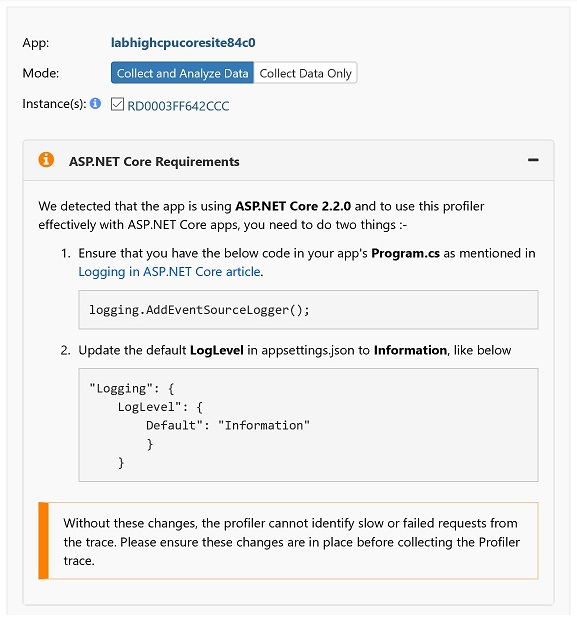
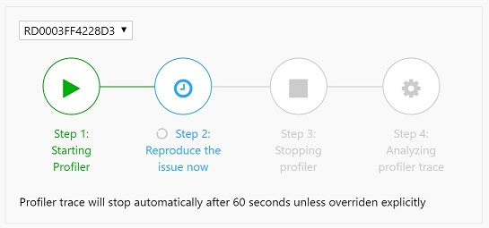
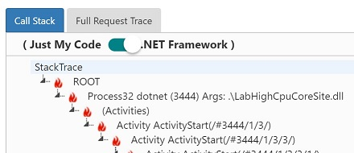
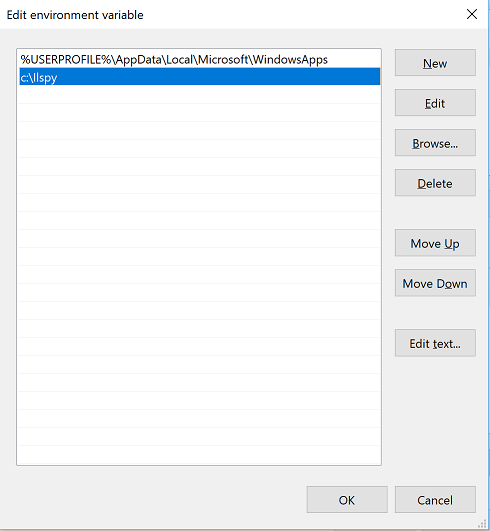

# Workshop - High CPU Site
>Note: This workshop applies to not only .NET Core, but also .NET Framework websites, except that .NET Framework is hosted in-process in the w3wp.exe process.

## Environment setup

First of all, click the [Deploy to Azure](https://github.com/4lowTheRabbit/LabHighCpuCoreSite) button on the README page of [this workshop's GitHub repository](https://github.com/4lowTheRabbit/LabHighCpuCoreSite).


Follow the wizard to provision the resource.


After the deployment is done, a resource group will be created with the following resource items:
* An app service plan
* An app service site


In order to repro the high CPU issue in the site, we can browse `/repro/` of the site. It will do an infinite loop, which will cause high CPU on the server, until the page times out. We will see the page is loading long and finally a 500 error page in the browser.

>Interestingly that the 500 page shows `"The specified CGI application encountered an error and the server terminated the process."`, but actually the dotnet.exe process is not terminated. You can open Kudu and observe its process ID is not changed in Process Explorer. The error message on the page is just too generic to be true, like many others.


To stop the loading page, browse `/repro/disable`, so that it will exit the loop and return immediately. Further requests to the page will return immediately too.

To enable the infinite loop in the page again, we can browse `/repro/enable` and then browse `/repro/`.

The backend code is straight forward. You can read it [here](https://github.com/4lowTheRabbit/LabHighCpuCoreSite/blob/master/LabHighCpuCoreSite/Controllers/ReproController.cs).

>Note: Since .Net Core 2.2, the ASP.Net core web application is no longer hosted in dotnet.exe, instead it is hosted [in-process](https://docs.microsoft.com/en-us/aspnet/core/fundamentals/servers/index?view=aspnetcore-2.2&tabs=windows#in-process-hosting-model) in w3wp.exe by default. This is because the original aspNetCore module in web.config has been replaced by the new AspNetCoreModuleV2 module.

## Profile the .Net core process
On the Azure portal, in the **"Diagnose and Solve Problems" (DaaS)** blade, in the **"Diagnostic Tools"** tile, let's click **"Profiler"**.

Check **"ASP.NET Core"** as the application stack and then click the **"Collect .NET Profiler Trace"** button.


The profiler is smart as it is capable of detecting the runtime version of the target .NET Core application. Profiler trace is not enabled by default in versions before 2.2.3. If it is an old version, profiler will list out the changes that are needed, in order to generate the trace.



This workshop's web project has been updated with these code and configuration changes:

* [The code change](https://github.com/4lowTheRabbit/LabHighCpuCoreSite/blob/master/LabHighCpuCoreSite/Program.cs#L24)
* [The configuration change](https://github.com/4lowTheRabbit/LabHighCpuCoreSite/blob/master/LabHighCpuCoreSite/appsettings.json#L4)

A default ASP.NET core project would need to apply these changes first, before we can troubleshoot high CPU issues by profiler.

### Collect the profiler trace

Browse `/repro/enable` again to enable the infinite loop in the code.

Click the **"Collect Profiler Trace"** button to start a new profiling session.


Hold on when profiler is starting.


When it shows **"Step 2: Reproduce the issue now"**, browse `/repro/` to reproduce the high CPU issue.



In about 20 seconds, before it shows **"Step 3:  Stopping profiler"**, browse `/repro/disable` to finish the high CPU request. A request must finish before profiler is shutdown, otherwise we won't see its details in the report.

Wait for the profiler to be stopped and the profiler trace to be generated.

### Read the profiler trace report

Click the report link to pop up the profiler report.


Under the **".Net Core Slow Requests"** tab, click the **"Stack Trace"** button of the slow request.


Move the slide to **".NET Framekwork"**, instead of **"Just My Code"**. The user code is deep under the .Net Framework functions in the invocation tree, so we have to select **".NET Framework"**, in order to see the user function.



Observe the high CPU user function in the stack tree.


If you see the following message when expanding a stack trace, it should be due to the profiler is stopped before the request finishes.


### Decompile the code of ReproController.DoJob() from LabHighCpuCoreSite.dll

Let's go back again to the Kudu site and open **Debug Console** -> **CMD**

CD to `D:\home\site\wwwroot\`, click the download button to download `LabHighCpuCoreSite.dll`


Download and unzip ILSpy tool from its [Download Page](https://github.com/icsharpcode/ILSpy/releases) . Launch ILSpy to open `LabHighCpuCoreSite.dll`

>Note: The latest version of ILSpy.exe hides private functions by default. Make sure you have checked "Show internal types and members" from the View menu.


## Debug the high CPU process

We cannot hold and debug an issue online for root cause for hours in a production environment. Dump files are captured as snapshots of a process, which can be debugged offline later by WinDBG. 

>Note: This dump section only applys to .Net Core versions before 2.2. Since version 2.2, .NET Core web applications are hosted in w3wp.exe [in-process](https://docs.microsoft.com/en-us/aspnet/core/fundamentals/servers/index?view=aspnetcore-2.2&tabs=windows#in-process-hosting-model), instead of [out-of-processs](https://docs.microsoft.com/en-us/aspnet/core/fundamentals/servers/index?view=aspnetcore-2.2&tabs=windows#out-of-process-hosting-model) in dotnet.exe previously. The debugger extension of WinDBG currently doesn't work in this new scenario.

### Collect the dump file
In the **"Diagnose and solve problems" (DaaS)** blade of the site on the Azure portal, click **"Memory Dump"** in the **"Diagnostic Tools"** tile.

Check **"ASP.NET Core"** as the application stack and then click the **"Collect Memory Dump"** button.

Repro the issue, like we did in the profiler section, by browsing `/repro/enable` first and then `/repro/`

Click **"Collect Memory Dump"** when the page is still loading.

>Note: Usually we capture at least 3 dumps, in interval of one or several minutes. This is because 1 snapshot of a process would be ambiguous to conclude on the root cause of a high CPU issue. As for this workshop, since its simple and CPU is high enough, capturing just 1 dump file should be adequate to find out the root cause.


The automatically generated dump analysis report doesn't work well for .NET Core dumps, hence we need to download the .dmp file to local and manually debug it.

Click the file link to download the .dmp dump file of the dotnet.exe process.


### Setup WinDBG
Search WinDBG in windows 10's Microsoft store app


Install and launch the WinDbg app

Open the .dmp dump file by WinDbg


>Note: This is a 32bit process, since the debugger shows `Free X86 compatible` when loading the dump
>    ```
>    Windows 10 Version 14393 UP Free x86 compatible
>    Product: Server, suite: TerminalServer DataCenter SingleUserTS
>    10.0.14393.2430 (rs1_release_inmarket_aim.180806-1810)
>    Machine Name:
>    Debug session time: Mon Jan 28 10:37:00.000 2019 (UTC + 8:00)
>    System Uptime: 3 days 8:18:56.982
>    Process Uptime: 0 days 0:40:02.000
>    ................................................................
>    ................................................................
>    ................................................................
>    ......
>    For analysis of this file, run !analyze -v
>    eax=00000000 ebx=00000001 ecx=00000000 edx=00000000 esi=00000001 edi=00000001
>    eip=7762f29c esp=0297e130 ebp=0297e2c0 iopl=0         nv up ei pl nz ac pe nc
>    cs=0023  ss=002b  ds=002b  es=002b  fs=0053  gs=002b             efl=00000216
>    ntdll!NtWaitForMultipleObjects+0xc:
>    7762f29c c21400          ret     14h
>
>    ```

Please be patient for WindBG to load all symbol files. It will take a few minutes for the first time when debugging a dump.


    
Download the Mex Debugging Extension for WinDbg from https://www.microsoft.com/en-us/download/details.aspx?id=53304

Run it and extract to C:\Debugger\Mex . A zip file will be created there.
 
Then extract the zip file to C:\Debugger\Mex\ . Ensure that you can find mex.dll under folder C:\Debugger\Mex\x86

Run `.load C:\Debugger\Mex\x86\mex.dll` in the command window to load the Mex extension


 
```
0:000> .load C:\Debugger\Mex\x86\mex.dll
Mex External 3.0.0.7172 Loaded!
```

## Debug the dump file
Run `~*e !clrstack2` to dump out the .Net call stacks of all threads in that process.

* `~*e` means to execute a debugging command to all threads.
* `!clrstack2` is a debugging command of Mex, which can be used to dump out the call stack of a thread.

The high CPU thread's call stack looks like below
```
SP       IP       Function   Source
0babe698 00000000 InlinedCallFrame
0babe694 622303ca DomainNeutralILStubClass.IL_STUB_PInvoke() 
    0babe698 00000000 InlinedCallFrame 
0babe6c8 0b2924fe LabHighCpuCoreSite.Controllers.ReproController.DoJob() 
...
```

## Decompile the code
It is handy to decompile a .NET function by Mex in WinDBG

Add where you extracted ILSpy to the `path` environment variable



Run `!ilpsy LabHighCpuCoreSite.Controllers.ReproController.DoJob`.
    
Mex will extract HighCPUWebJobDotNet.exe from the dump, launch an ILSpy window to open HighCPUWebJobDotNet.exe, and to show the decompiled code.

Here is its output in my WinDBG:
```
0:000> !ilspy LabHighCpuCoreSite.Controllers.ReproController.DoJob
Scanning for Name or Module address of: LabHighCpuCoreSite.Controllers.ReproController.DoJob
ILspy could not find module LabHighCpuCoreSite.Controllers.ReproController.DoJob
Scanning Metadata:
Beginning scan of types:
LabHighCpuCoreSite.Controllers.ReproController.DoJob (LabHighCpuCoreSite.dll)(CodeAddr=0b2924d0) 

Scanned 5100 Types and 87619 Methods. Skipped 0 Types and 0 Methods. Found 0 Types and 1 Methods.
Found a single Method match. Launching
Found module C:\Users\user\AppData\Local\Temp\Modules-10a23a0c-5ef7-497d-a28a-df170d0558c6\LabHighCpuCoreSite.dll
Using PATH to launch ilspy. (Could not be found in C:\Debuggers\ILSpy\)
Launching ilspy.exe with arguments C:\Users\user\AppData\Local\Temp\Modules-10a23a0c-5ef7-497d-a28a-df170d0558c6\LabHighCpuCoreSite.dll /navigateTo:M:LabHighCpuCoreSite.Controllers.ReproController.DoJob

```

And the decompiled code:
    


## Clean up
Delete the resource group of this workshop to delete the resource items and save the cost.