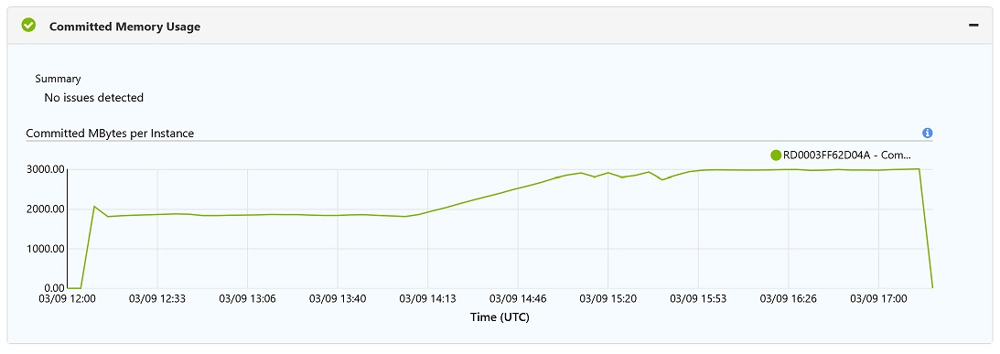
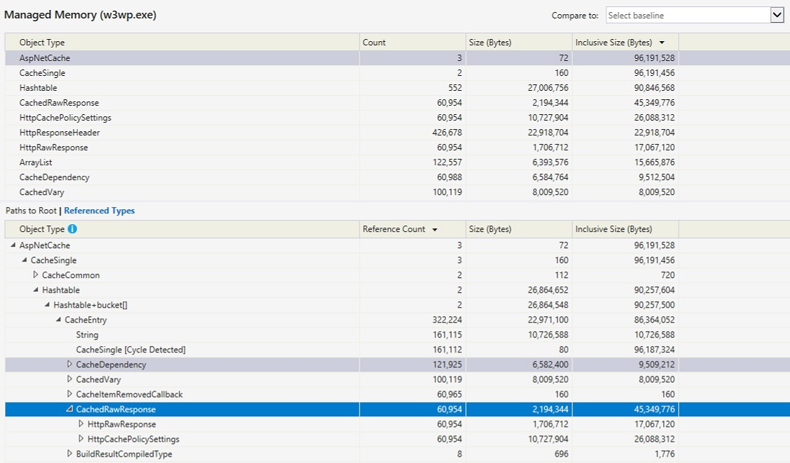
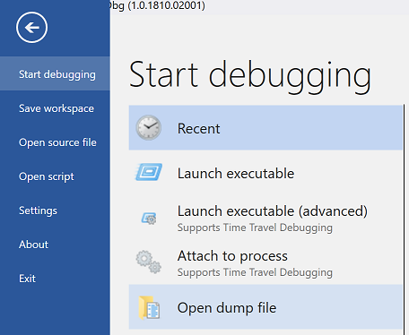

# Workshop - High Memory Site
## Environment setup
### Provision the resource
First of all, click the [Deploy to Azure](https://github.com/4lowTheRabbit/LabMemoryLeakSite) button on the README page of [this workshop's GitHub repository](https://github.com/4lowTheRabbit/LabMemoryLeakSite).


Follow the wizard to provision the resource.


After the deployment is done, a resource group will be created with the following resource items:
* An app service plan
* An app service site


### The code which "leaks" memory
This lab is based on the following code, which has a OutputCache configured to cache the responses of the ``Cached`` action for 3 days. Another action ``Index`` sends requests to ``Cached``, with a different ``id`` parameter value in each request. Due to OutputCache is configured to vary by parameter ``id``, the requests from ``Index`` to ``Cached`` result in an expanding of memory used to cache the responses from ``Cached``. These memory is hold up by the cache, contributes to the Committed Bytes metric of the process, for 3 days. There are real-world web applications who "leak" memory due to unsophisticated cache algorithm and configurations.
```C#
public class ReproController : Controller
{
    static volatile int id = 0;
    static HttpClient client = new HttpClient();
    public async Task<ActionResult> Index()
    {
        string schema = Request.IsSecureConnection ? "https": "http";
        string serverName = Request.ServerVariables["server_name"];
        string serverPort = Request.ServerVariables["server_port"];
        string path = Request.ApplicationPath;
        string urlString = $"{schema}://{serverName}:{serverPort}{path}Repro/Cached/{id++}";
        string response = await client.GetStringAsync(urlString);

        ViewData["URL"] = urlString;
        ViewData["Response"] = response;
        return View();
    }

    [OutputCache(Duration = 3*24*60*60, VaryByParam = "id")]
    public ActionResult Cached(int id)
    {
        ViewBag.Id = id;
        return View();
    }
}
```
### Repro the high memory issue
In order to repro the high memory issue in the site, we can take the following steps

1. Launch a Linux Bash shell

    I use Ubuntu via the Windows Subsystem of Linux.
2. Run the following command to install `ab` utilility
    ```
    sudo apt update
    sudo apt install apache2-utils
    ```
3. Use `ab` to send 100000 requests to the site.
    
    Replace the site name in the following URL with yours.
    ```
    ab -n 100000 -c 5 -s 300 -k http://labmemoryleaksite33c9.azurewebsites.net/repro
    ```

Under ``Memory Analysis`` of the ``Diagnose and solve problems`` blade of the site, observe ``Physical Memory Usage`` of the site climbs up.

So does the ``Committed Memory Usage`` metric of the instance.



## Troubleshoot the high memory issue
In real cases, we can find out the causes of high memory issues through the following steps.

### Collect a dump file when process memory is high
1. On the Azure portal, in the ``Diagnose and solve problems`` blade of the site, click **"Memory Dump"** in the ``Diagnostic Tools`` tile.

2. Check ``ASP.NET`` as the application stack and then click the ``Collect Memory Dump`` button.

3. Select ``Collect Data Only`` and then click ``Collect Memory Dump`` **when memory is high**.

    

4. It can take a few minutes for the diagnostic tool to write the big memory dump file. After that, click the download link to download the .dmp dump file.

    

### Use Visual Studio 2019 to do memory usage analysis
1. Drag and drop the .dmp dump file to Visual Studio.
2. Click the ``Debug Managed Memory`` Action

    
2. In the usage report, we can see that ASP.NET Cache is responsible for most of the memory objects.

    

### Use PerfView to do memory usage analysis
1. Download and install PerfView from its [Download Page](https://github.com/Microsoft/perfview/blob/master/documentation/Downloading.md).

2. From PerfView's memu, select ``memory`` -> ``Take Heap Snapshot From Dump``.
    

3. Enter path of the dump and the output files and then click the "Dump GC Heap" button.

    

8. The report shows the ASP.NET cache is responsible for most of the memory usage.
    
    

### Use WinDBG to do memory usage analysis
1. Search WinDBG in windows 10's Microsoft store app
    
2. Install and launch the WinDbg app
3. Open the .dmp dump file by WinDbg
    

    >Note: This is a 32bit process, since the debugger shows `Free X86 compatible` when loading the dump
    >```
    >Windows 10 Version 14393 UP Free x86 compatible
    >Product: Server, suite: TerminalServer DataCenter SingleUserTS
    >10.0.14393.2430 (rs1_release_inmarket_aim.180806-1810)
    >Machine Name:
    >Debug session time: Sun Mar 10 02:00:27.000 2019 (UTC + 8:00)
    >System Uptime: 10 days 13:36:44.128
    >Process Uptime: 0 days 5:44:33.000
    >```

    Please be patient for WindBG to load all symbol files. It will take a few minutes for the first time when debugging a dump.

    
4. Load the 32bit version of debugger extension for .NET Framework, by running the folllowing command.
    ```
    .load C:\Windows\Microsoft.NET\Framework\v4.0.30319\sos.dll
    ```
5. Run ``!DumpHeap -stat`` to dump out memory usage grouped by type names.
    We can see that ``System.String`` takes most of the memory.
    ```
    ...
    7205f698   164327      2680860 System.String[]
    720632d0   127250      3054000 System.Collections.ArrayList
    720748c4   117260      3752320 System.Action`2[[System.Object, mscorlib],[System.EventArgs, mscorlib]]
    7205ef34   127999      3869232 System.Object[]
    6fd6f4d0   117254      4221144 System.Web.Caching.CacheDependency
    6fd41554   100119      4405236 System.Web.Caching.CachedVary
    72061ab8     1898      4689120 System.Collections.Hashtable+bucket[]
    6fd6d760     1327      4771892 System.Web.Caching.UsageEntry[]
    057c7888   106360      6427088      Free
    6fd533e8   426678      8533560 System.Web.HttpResponseHeader
    6fd54a90    60954      9752640 System.Web.HttpCachePolicySettings
    6fd6d530   245618     18666968 System.Web.Caching.CacheEntry
    7205eb40   842563     53860084 System.String
    Total 3097304 objects
    Fragmented blocks larger than 0.5 MB:
        Addr     Size      Followed by
    15282118    1.3MB         153cc8d0 System.Byte[]
    ```
6. Dump out the string objects by using the Method Table (mt) value in the first column of the System.String row above.
    ```
    !dumpheap -mt 7205eb40
    ```
    >Note: It takes time to dump out all of the string objects in a big dump file. Press CTRL+BREAK to stop, if you want.

    >Note: Use ``.logopen`` to let the debugger write its output to a disk file and then ``.logclose`` to close it.
7. In order to observe how the ``String`` objects are referenced, randomly pick up their memory addresses and run ``!gcroot %address%``.
    
    For instance, the following reference chain shows the string object is referenced by the ASP.NET Cache.
    ```
    0:000> !gcroot 2b960fe0 
    HandleTable:
        06821108 (strong handle)
        -> 06a481f0 System.Web.NativeFileChangeNotification
        -> 06a481cc System.Web.DirMonCompletion
        -> 06a47fe8 System.Web.DirectoryMonitor
        -> 06a48010 System.Collections.Hashtable
        -> 06a48044 System.Collections.Hashtable+bucket[]
        -> 06a480f4 System.Web.FileMonitor
        -> 06a48128 System.Collections.Specialized.HybridDictionary
        -> 06a4816c System.Collections.Specialized.ListDictionary
        -> 06a48188 System.Collections.Specialized.ListDictionary+DictionaryNode
        -> 068f931c System.Web.FileChangesMonitor
        -> 068f93cc System.Collections.Hashtable+SyncHashtable
        -> 068f9358 System.Collections.Hashtable
        -> 06a8c25c System.Collections.Hashtable+bucket[]
        -> 06a8c154 System.Web.FileMonitor
        -> 06a28e78 System.Web.DirectoryMonitor
        -> 06a28ea0 System.Collections.Hashtable
        -> 06a8c1b0 System.Collections.Hashtable+bucket[]
        -> 06a290f0 System.Web.FileMonitor
        -> 06a29124 System.Collections.Specialized.HybridDictionary
        -> 06a2914c System.Collections.Specialized.ListDictionary
        -> 06ab6708 System.Collections.Specialized.ListDictionary+DictionaryNode
        -> 06ab6644 System.Web.Caching.CacheDependency
        -> 06ab6878 System.Action`2[[System.Object, mscorlib],[System.EventArgs, mscorlib]]
        -> 06ab682c System.Web.Caching.CacheEntry
        -> 068faaf0 System.Web.Caching.CacheSingle
        -> 068fab34 System.Collections.Hashtable
        -> 07d58bc8 System.Collections.Hashtable+bucket[]
        -> 2b961130 System.Web.Caching.CacheEntry
        -> 2b96117c System.Web.Caching.CacheDependency
        -> 2b961250 System.Action`2[[System.Object, mscorlib],[System.EventArgs, mscorlib]]
        -> 2b961204 System.Web.Caching.CacheEntry
        -> 2b960fe0 System.String

    Found 1 unique roots (run '!GCRoot -all' to see all roots).

    ```
    Here is my debugger's [output](dbg.txt) for download.

## Clean up
Delete the resource group of this workshop to delete the resource items and save the cost.

## Useful links:
* https://bennettadelson.wordpress.com/2013/04/11/using-perfview-to-diagnose-a-net-memory-leak-2/
* https://docs.microsoft.com/en-us/visualstudio/misc/analyze-dotnet-framework-memory-issues?view=vs-2015#BKMK_Analyze_memory_use
* https://blogs.msdn.microsoft.com/tess/2008/03/17/net-debugging-demos-lab-6_memory-leak/
