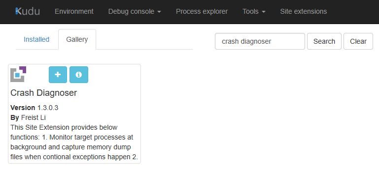

# Workshop - Crash
## Environment setup
### Provision the resource
Click the [Deploy to Azure](https://github.com/4lowtherabbit/LabCrashFromBackground) button on the README page of [this workshop's GitHub repository](https://github.com/4lowtherabbit/LabCrashFromBackground).


Follow the wizard to provision the resource.

After the deployment is done, a resource group will be created with the following resource items:
* An app service plan with 2 worker instances
* An app service site

### The code which crashes the process
The web application starts a background thread, which throws an unhandled exception when the static  variable `CrashIt`'s value is changed to true;

```C#
public class MvcApplication : System.Web.HttpApplication
{
    protected void Application_Start()
    {
        AreaRegistration.RegisterAllAreas();
        FilterConfig.RegisterGlobalFilters(GlobalFilters.Filters);
        RouteConfig.RegisterRoutes(RouteTable.Routes);
        BundleConfig.RegisterBundles(BundleTable.Bundles);

        Thread t = new Thread(WaitForCrash);
        t.Start();
    }

    public static bool CrashIt = false;

    static void WaitForCrash()
    {
        while(true)
        {
            Thread.Sleep(10000);
            if(CrashIt)
                throw new ApplicationException("Crashing...");
        }
    }
}
```

Variable `CrashIt` is set to true by the `Crash` action of `ReproController`

```C#
public string Crash()
{
    MvcApplication.CrashIt = true;
    return "Process will crash in 10 seconds";
}
```

### Repro the crash issue
The web application's w3wp.exe will crash, if you browse `/Repro/Crash` of the site.

## Troubleshoot the crash issue
### Collect a crash dump file by CrashDiag
1. Open the kudu site and click `Site Extensions`
2. Search and install "Crash Diagnoser"

3. Then click the `Restart Site` Button on the top right corner to apply the change.
4. Click the Launch button to open the Crash Diagnoser configuration page.

    Or you can open it directly at https://appname.scm.azurewebsites.net/crashdiag/
5. Select `2nd Chance Unhandled Exception` and click `Start`
6. Wait for the state to change from `Wait for Starting Monitoring` to `Monitoring 1 Process on RD501AC5042FB1` like
7. Open file `D:\home\site\wwwroot\App_Data\Jobs\Continuous\CrashHelper\crashHelper.settings`, Change the last line from
    ```
    -instancename
    RD501AC5042FB1
    ```
    to
    ```
    -instancename
    _all_instances
    ```
    No need to restart the site.

    The app service plan contains 2 worker instances. The crash can happen in any of them. By default, the CrashDiag site extension only runs in one instance. We need to make it multiple instances by the above change.
    Each instance has a .txt log file in folder `D:\home\LogFiles\CrashDiag`. You can open the log files to confirm it is monitoring in every instance.

8. Browse /Repro/Crash to crash the process.
9. Observe a dump file will be saved to D:\home\LogFiles\CrashDiag
    Download it to local for analysis.

### Use WinDBG to do crash analysis
1. Search WinDBG in windows 10's Microsoft store app

    

2. Install and launch the WinDbg app
3. Open the .dmp dump file by WinDbg

    

    >Note: This is a 32bit process, since the debugger shows `Free X86 compatible` when loading the dump
    >```
    >Windows 10 Version 14393 UP Free x86 compatible
    >Product: Server, suite: TerminalServer DataCenter SingleUserTS
    >10.0.14393.2430 (rs1_release_inmarket_aim.180806-1810)
    >Machine Name:
    >Debug session time: Mon Jul  8 21:09:31.000 2019 (UTC + 8:00)
    >System Uptime: 0 days 2:19:02.145
    >Process Uptime: 0 days 0:02:13.000
    >```

    Please be patient for WindBG to load all symbol files. It will take a few minutes for the first time when debugging a dump.

    

4. Load the 32bit version of debugger extension for .NET Framework, by running the following command.

    ```
    .load C:\Windows\Microsoft.NET\Framework\v4.0.30319\sos.dll
    ```

5. Run ``!pe`` to print the unhandled exception together with the call stack which throws it.
    
    ```
    0:023> .load C:\Windows\Microsoft.NET\Framework\v4.0.30319\sos
    0:023> !pe
    Exception object: 09e16b78
    Exception type:   System.ApplicationException
    Message:          Crashing...
    InnerException:   <none>
    StackTrace (generated):
        SP       IP       Function
        0875F5EC 08355E8D UNKNOWN!LabCrashFromBackground.MvcApplication.WaitForCrash()+0x45
        0875F5F8 720A710D mscorlib_ni!System.Threading.ThreadHelper.ThreadStart_Context(System.Object)+0x9d
        0875F604 720D40C5 mscorlib_ni!System.Threading.ExecutionContext.RunInternal(System.Threading.ExecutionContext, System.Threading.ContextCallback, System.Object, Boolean)+0xe5
        0875F670 720D3FD6 mscorlib_ni!System.Threading.ExecutionContext.Run(System.Threading.ExecutionContext, System.Threading.ContextCallback, System.Object, Boolean)+0x16
        0875F684 720D3F91 mscorlib_ni!System.Threading.ExecutionContext.Run(System.Threading.ExecutionContext, System.Threading.ContextCallback, System.Object)+0x41
        0875F69C 720A7068 mscorlib_ni!System.Threading.ThreadHelper.ThreadStart()+0x44

    StackTraceString: <none>
    HResult: 80131600
    ```

## Resources
* [Use Crash Diagnoser Site Extension to Capture Dump for Intermittent Exception issues or performance issues on Azure Web App](https://blogs.msdn.microsoft.com/asiatech/2015/12/28/use-crash-diagnoser-site-extension-to-capture-dump-for-intermittent-exception-issues-or-performance-issues-on-azure-web-app/)
* [Tips of Crash Diagnoser](http://blogs.msdn.com/b/asiatech/archive/2016/01/15/tips-of-using-crash-diagnoser-on-azure-web-app.aspx)
* [Troubleshoot Stack Overflow on Azure Web APP](http://blogs.msdn.com/b/asiatech/archive/2016/01/12/how-to-use-crashdiag-to-capture-stack-overflow-exception-dump-in-mvc-web-app-on-microsoft-azure.aspx)